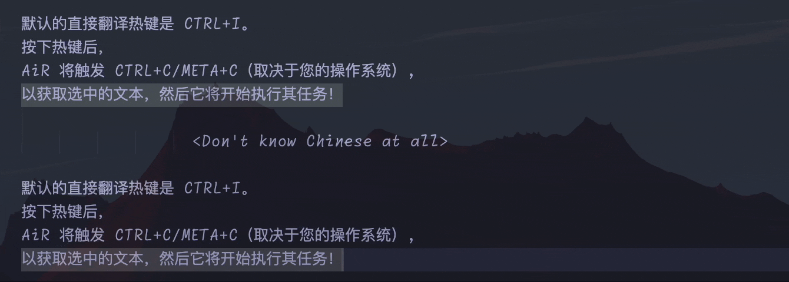

<div align="center">

# AiR
<h3>AI with Rust ｜ </h3>

[](https://www.gnu.org/licenses/gpl-3.0)
[](https://github.com/hack-ink/air/actions/workflows/checks.yml)
[](https://github.com/hack-ink/air/actions/workflows/release.yml)
[](https://github.com/hack-ink/air/tags)
[](https://github.com/hack-ink/air)

这款完全用 Rust 构建的 AiR 提供了惊人的速度和效率！

AiR 拥有两个主要功能：准确的翻译和无缝的文本重写，旨在极大地提升您的生产力。

AiR 是非母语者的绝佳助手，能够自动修正错误并润色语言，使其听起来像母语使用者。

更多精彩功能即将推出！

[English](README.md) ｜ [中文](README-zh-CN.md)

本文完全由 AiR 翻译[英文原版](README.md)生成，如有错误请提交 issue 或 PR 进行修正。
</div>


## 功能亮点
### 用户界面
<div align="center"> </div>

### 直接重写


### 直接翻译



## 状态
- **操作系统**
  - [x] **macOS**
  - [x] **Windows**
  - [ ] **Unix**
    - [x] 主要功能。
    - [ ] 某些窗口功能，例如 “失去焦点时隐藏” 和 “置顶”，在 Unix 系统上不可用。
- **功能**
  - [x] **深色/浅色主题**
  - [x] **重写**
  - [x] **直接重写**
  - [x] **翻译**
  - [x] **直接翻译**
  - [ ] **重构代码** (即将推出)
  - [ ] **光学字符识别** (已计划)
  - [ ] **文字转语音** (已计划)


## 用法
### 安装
#### 从源代码构建
```sh
# 克隆仓库。
git clone https://github.com/hack-ink/air
cd air

# 要在 macOS 和 Unix 上安装 Rust，请运行以下命令。
#
# 要在 Windows 上安装 Rust，请从 `https://rustup.rs` 下载并运行安装程序。
curl --proto '=https' --tlsv1.2 -sSf https://sh.rustup.rs | sh -s -- --default-toolchain stable

# 安装必要的依赖项。(仅限 Unix 系统)
# 以 Ubuntu 为例，这实际上取决于你的发行版。
sudo apt-get update
sudo apt-get install libasound2-dev libxdo-dev

# 构建项目后，二进制文件将位于 `target/release/air`。
cargo build --release

# 如果您是 macOS 用户并且想拥有一个 `AiR.app`，请运行以下命令。
# 安装 `cargo-bundle` 将二进制文件打包成应用程序。
cargo install cargo-bundle
# 打包应用程序后，它将位于 `target/release/bundle/osx/AiR.app`。
cargo bundle --release
```

#### 下载预构建二进制文件
- **GitHub Releases**
  - [这里](https://github.com/hack-ink/air/releases/latest)下载最新的预构建二进制文件。
- **Homebrew**
  - 已计划

### 配置
#### API 密钥
**请在首次运行 AiR 时配置 API 密钥！**

1. `打开 AiR。`
2. `请导航到 “Setting” 面板。`
3. `点击 “AI” 部分。`
4. `请填写 “API Key” 字段。`

#### 打开来自未识别开发者的 Mac 应用程序 (仅限 macOS)
当您第一次打开 AiR 时，您会看到以下消息：

`“AiR” 无法打开，因为无法验证开发者。`

由于我不是认证开发者，您需要允许 AiR 在您的 Mac 上运行。

请请我喝杯咖啡，以便我能获得一个 Apple 开发者证书。 😄

1. `打开“系统偏好设置” -> “隐私与安全性”。`
2. `请向下滚动到 ‘“AiR” 因不是来自已识别的开发者而被阻止使用’ 部分。`
3. `点击 “仍然打开”。`

相关资源：
- [打开来自未识别开发者的 Mac 应用程序 (support.apple.com)](https://support.apple.com/en-hk/guide/mac-help/mh40616/mac)
- [如何打开来自未识别开发者的 Mac 应用程序 (macworld.com)](https://www.macworld.com/article/672947/how-to-open-a-mac-app-from-an-unidentified-developer.html)

#### 获取系统辅助功能权限 (仅限 macOS)
要控制键盘并使用系统剪贴板进行数据读写，
AiR 必须获得系统辅助功能权限。

1. `打开 “系统设置” -> “隐私与安全” -> “辅助功能”。`
2. `点击 “+” 按钮，然后添加 “AiR.app” 或 “air” 二进制文件。`

#### 设置
你可以通过导航到 “Setting” 面板来配置设置。

- 通用
  - 字体大小
  - 失去焦点时隐藏：当 AiR 失去焦点时隐藏它。
  - 置顶：保持 AiR 在其他窗口之上。
- AI
  - API 基础：AI API 的基本 URL。确保不要忘记 `v1` 部分。(例如：https://api.openai.com/v1)。
  - API 密钥
  - 模型
  - 模型名称：仅当模型设置为 “自定义” 时可用。
  - 温度：人工智能的不可预测性。
  - 重写提示：附加到默认的额外提示。
  - 翻译提示：附加到默认的额外提示。
- 快捷键
  - 重写​
  - 直接重写​
  - 翻译​
  - 直接翻译
- 开发
  - 日志级别

AiR目前正在进行大量开发，并非所有设置都会在用户界面中始终可用。

然而，所有设置始终可以在设置文件中找到。

设置文件的位置因操作系统而异。
- `~/Library/Application\ Support/AiR/setting.toml` (macOS)
- `C:\Users\<username>\AppData\Roaming\hack.ink\AiR\setting.toml` (Windows)
- `~/.config/AiR/setting.toml` (Unix)

### 交互
- 在输入区域中键入文本，然后在 macOS 上按 `META+ENTER` 或在其他操作系统上按 `CTRL+ENTER` 以触发相应的功能。
- 您还可以选择文本并使用快捷键直接对选定的文本应用相应的功能。

### 更新
正在开发自动更新功能。

目前，您可以通过重复安装步骤来手动更新 AiR。

#### 重新获得系统访问权限 (仅适用于macOS)
有时候，在更新 AiR 后，您可能需要重新获取系统访问权限。然而，大多数情况下，这一步是没有必要的。
1. `按照 “获取系统访问权限” 部分找到 “AiR.app” 或 “air” 二进制文件。`
2. `点击 “-” 按钮以移除现有权限，然后点击 “+” 按钮重新添加权限。`


## 开发
### 架构
<div align="center">

```mermaid
graph TD
    A[AiR]
    A --> B[组件]
    A --> C[操作系统]
    A --> D[服务]
    A --> E[状态]
    A --> F[用户界面]
    B --> B1[数据结构]
    C --> C1[macOS/Unix/Windows]
    D --> D1[后台进程]
    E --> E1[同步]
    F --> F1[交互]
```

**基于 [egui](https://github.com/emilk/egui)，这是一个用纯 Rust 编写的快速跨平台 GUI 工具包。**
</div>

- **组件**
  - 提供程序其他部分使用的基本数据结构和函数。
  - 组件应该是静态的，不要包含任何可变状态。
- **操作系统**
  - 提供与操作系统交互的封装API。
  - 需要在此处理操作系统之间的差异，并以总结、抽象的方式呈现。
- **服务**
  - 提供后台任务能力，使其可以独立于 UI 运行。
  - 服务有一个或多个对缓存组件的要求，以节省系统资源、执行频繁的检查或更新，以及处理时间敏感的任务。
  - 与 UI 设置相关的服务应提供热重载功能，以便在 UI 上更改设置时，立即应用这些更改。
  - 服务应包含中止功能，以停止服务，并且在程序退出时应调用此功能，以防止其停滞。
- **状态**
  - 提供可变性，可以在整个程序中同步和共享。
  - 状态应该是 `Arc<parking_lot::Mutex/RwLock<_>>` 或 `Arc<std::sync::atomic::Atomic*>`。
- **用户界面**
  - 为用户提供与其他部分互动的能力。


## 支持我
如果您觉得这个项目有帮助，并且希望支持其开发，可以请我喝杯咖啡！

您的支持非常感谢，并激励我不断改进这个项目。

- **法币**
  - [Ko-fi](https://ko-fi.com/aurevoirxavier)
  - [爱发电](https://afdian.com/a/AurevoirXavier)
- **加密货币**
  - **Bitcoin**
    - `bc1pedlrf67ss52md29qqkzr2avma6ghyrt4jx9ecp9457qsl75x247sqcp43c`
  - **Ethereum**
    - `0x3e25247CfF03F99a7D83b28F207112234feE73a6`
  - **Polkadot**
    - `156HGo9setPcU2qhFMVWLkcmtCEGySLwNqa3DaEiYSWtte4Y`

感谢您的支持！


## 感谢
我们要向以下项目和贡献者表达由衷的感谢：
- [egui](https://github.com/emilk/egui) 为我们的 GUI 提供了基础。
- Rust 社区对 Rust 生态系统的持续支持和开发。


## 其他鸣谢​
- 感谢 [OpenAI Translator](https://github.com/openai-translator/openai-translator) 为本工作提供灵感。
- 通过 [recraft.ai](https://app.recraft.ai) 创建的精彩图标。


<div align="right">

#### 许可证
<sup>根据 [GPL-3.0](LICENSE) 许可进行授权。</sup>
</div>
